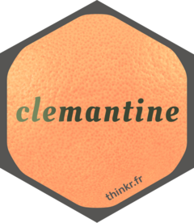

<!-- README.md is generated from README.Rmd. Please edit that file -->

```{r, include = FALSE}
knitr::opts_chunk$set(
  collapse = TRUE,
  comment = "#>",
  fig.path = "man/figures/README-",
  out.width = "100%"
)
```

# {clemantine} 

<!-- badges: start -->
[](https://lifecycle.r-lib.org/articles/stages.html#experimental)
[](https://github.com/ThinkR-open/clemantine/actions/workflows/R-CMD-check.yaml)
<!-- badges: end -->

`{clemantine}` is a package that provides a set of functions around the React component library [Mantine](https://mantine.dev/).

## Installation

You can install the development version of `{clemantine}` from [GitHub](https://github.com/) with:

```{r, eval=FALSE}
# install.packages("devtools")
devtools::install_github("ThinkR-open/clemantine")
```

## How to use clemantine?

```{r example, eval=FALSE}
library(clemantine)
```

_TODO_

## Code of Conduct

Please note that the clemantine project is released with a [Contributor Code of Conduct](https://contributor-covenant.org/version/2/1/CODE_OF_CONDUCT.html). By contributing to this project, you agree to abide by its terms.
